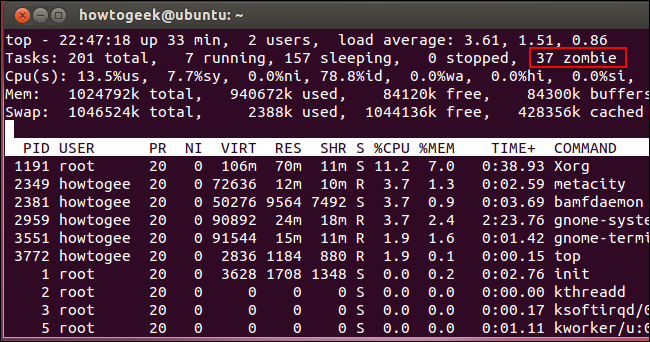

Introduction
------------

Nous sommes dans le cas où un processus est devenu Zombie.


Pourquoi Zombie
---------------

Lorsqu'un processus père créé un processus fils, par exemple avec la
fonction fork, il a le devoir d'écouter l'état de son fils et de
vérifier s'il n'est pas mort grâce aux fonctions **wait** et
**waitpid**.

Tout processus fils qui meurt et dont le père, toujours en vie, n'est
pas au courant, est appelé processus zombie. Ce processus a été
totalement désalloué de la mémoire mais reste toutefois présent dans la
table des processus. La table des processus étant limitée en taille et
chaque zombie occupant l'une des places disponibles, il pourrait devenir
impossible de créer de nouveaux processus, ce qui provoquerait un gel du
système.

Exemple d'affichage processus Zombie
------------------------------------

  

Allez, on va killer du zombie...
--------------------------------

-   Trouver le processus zombie

``` {.bash}
ps -A -ostat,ppid | grep -e '[zZ]'| awk '{ print $2 }'
```

-   tuer le processus

``` {.bash}
kill -HUP Num_Process
```

-   Une seul commande pour trouver et tuer les processus zombie

``` {.bash}
kill -HUP $(ps -A -ostat,ppid | grep -e '[zZ]'| awk '{ print $2 }')
```

