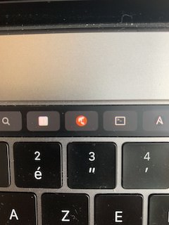

# Comment générer un docset pour dash avec un feed

## L'idée
Depuis ma documentation écrite en markdown, je souhaites partager celle-ci sur un autre support (Dash de kapeli)

    Je n'ai pas envie décrire plusieur fois la même chose.
    
Pour ce faire, je dois réaliser automatiquement, les étapes suivantes:

  * Pousser mes pages dans github
  * un webhook démarre la pipeline jenkins
  * tâche 1: On supprime la stack docset
  * tâche 2: On rappatrie le repo
  * tâche 3: rsync des éléments necessaires vers le docker volume
  * tâche 4: converstion mkdocs (fichiers *.md vers *.html)
  * tâche 5: html2dash pour créer un répertoire redbeard28.docset
  * tâche 6: on incrémente la version dans le fichier redbeard28.xml
  * tâche 7: tar --exclude='.DS_Store' -cvzf redbeard28.tgz redbeard28.docset téléchargeable depuis https://cheatsheets.redbeard-consulting.fr/feeds/redbeard28.tgz
 
 ## Tâches 1 à 4
 Voir documentation [ici](https://cheatsheets.redbeard-consulting.fr/docset/stack/docset-server/)
 
 ## Tâches 5
 
 Dans la pipeline, avant génération su serveur, il faut créer le redbeard28.tgz et mettre à jour le redbeard28.xml afin de les mettre à dispositions dans docs_srv/feeds pour qu'ils soient pris en compte dans la MAJ du site.
 
 
 ## Tâches 6 à 7:
 TODO: docker image + pipeline + documentation process
 
 ## Ajout du docset dans Dahs pour la prmière fois
 Depuis le navigateur (Chrome) de votre Mac, tapez ceci puis accèptez d'ouvrir avec Dash app
 
    dash-feed://https%3A%2F%2Fcheatsheets.redbeard-consulting.fr%2Ffeeds%2Fredbeard28.xml

Et voilà!