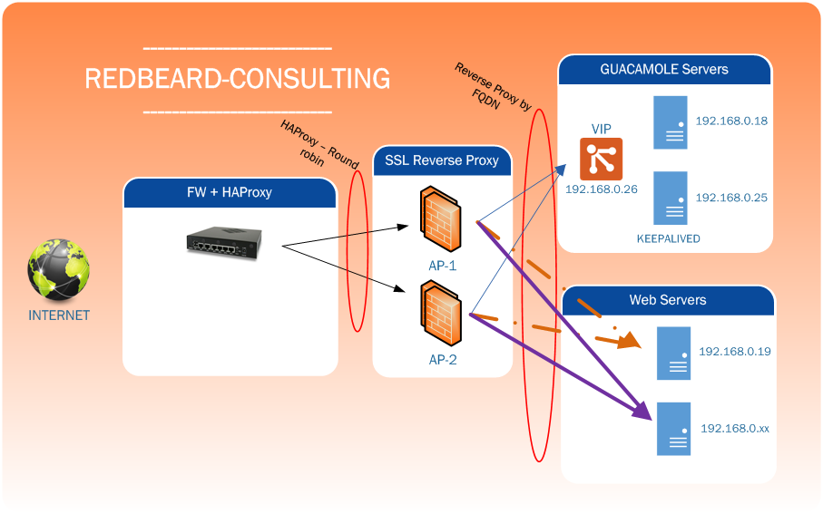

# Comment configurer keepalived

## Objet
Nous verrons dans ce document comment configurer keepalived pour deux serveurs guacamole. C'est juste pour l'exemple et le fun.

## Description de l'environnement
Nous sommes dans un environnement simple, dont voici le schéma



Comme on peut le constater notre point faible est le HAProxy car il n'y en a qu'un => c'est le firewall pfsense.

Le HAProxy fait du round-robin sur les deux serveurs Apache SSL (letsencrypte) en mode Reverse Proxy vers la VIP des serveurs Guacamole.


## Pourquoi cette idée folle?
En fait, tout est partie d'un problème de déconnexions intempestives sur mon serveur guacamole. A la base, il n'y avait qu'un seul reverse proxy qui permettait de protéger le port par défaut du tomcat8 (tcp_8080).

Je ne rappellerai pas les avantages et inconvennients du reverse proxy apache. Ici je l'utilise pour partager une seul IP WAN sur mes serveurs guacamole, cloud...

## Fichier keepalived.conf
Vous trouverez ce fichier dans:
```bash
/etc/keepalived/keepalived.conf
```


## Paramétrage du Master
Voici le paramétrage:
```bash
# Settings for notifications
global_defs {
    notification_email {
        admin@mon-domain.com     # Email address for notifications
    }
    notification_email_from guac01@domain.intra  # The from address for the notifications
    smtp_server 192.168.0.9     # You can specifiy your own smtp server here
    smtp_connect_timeout 15
}

# Configuation for the virtual interface
vrrp_instance VI_1 {
    interface ens160
    state MASTER        # set this to BACKUP on the other machine
    priority 101        # set this to 100 on the other machine
    virtual_router_id 51

    smtp_alert          # Activate email notifications

    authentication {
        auth_type AH
        auth_pass  3615codeULA     # Set this to some secret phrase
    }

    # The virtual ip address shared between the two loadbalancers
    virtual_ipaddress {
        192.168.0.26 dev ens160 # Pour les non anglophone, ceci est notre VIP
    }

    virtual_server 192.168.0.26 8080 {
    # monitored interval
    delay_loop 3
    # distribution method
    lvs_sched rr
    # routing method
    lvs_method DR
    protocol TCP
    }

    # backend server#1
    real_server 192.168.0.18 8080 {
        weight 1
        HTTP_GET {       # On check via un HTTP GET la disponibilité de l'URL 192.168.0.18:8080/guacamole
            url {
                # monitored path
                path /guacamole
                # status code for normally state
                status_code 200
            }
            # timeout(sec)
            connect_timeout 3
        }
    }

    # backend server#1
    real_server 192.168.0.25 8080 {
        weight 1
        HTTP_GET {       # On check via un HTTP GET la disponibilité de l'URL 192.168.0.25:8080/guacamole
            url {
                # monitored path
                path /guacamole
                # status code for normally state
                status_code 200
            }
            # timeout(sec)
            connect_timeout 3
        }
    }


}
```

### Comment ça marche?
Voir les commentaires qui sont assez explicites!


## Paramétrage des slaves
C'est pareil mais on remplace MASTER par BACKUP et on met un poids inférieur à celui du MASTER.


## En conclusion
Grace à keepalived, on peut faire un semblant de cluster passif permettant ainsi de faire de la haute disponibilité avec de l'open-source.

