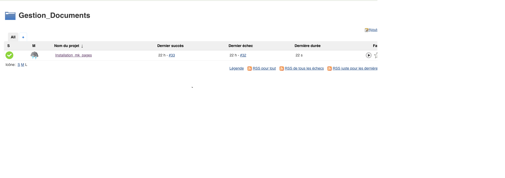

# Docset stack deployment

To deploy this stack, we need to make two GitHub repos.

  * generate a docker image with mkdocs (serve mode) [docker_mkdocs](https://github.com/redbeard28/docker_mkdocs.git)
  * populate markdown files in a nfs docker volume [docset](https://github.com/redbeard28/docset.git)
  

## Part 1 - Docker image docset_server ([repo docker_mkdocs](https://github.com/redbeard28/docker_mkdocs.git))
This image is very simple. We install mkdocs in the image and put a CMD to start to serve.


### Jenkins Build

In the folder Docset, I put a the Dockerfile, generate_doc.sh and a Jenkinsfile.

Use it to convert your mkdocs to docset for dash/zeal/velocity
```bash
#!/bin/bash

git clone https://github.com/redbeard28/docset.git .
docker run -i --rm -v ./docset:/work redbeard28/html2dash:0.1 -d Redbeard28 -i redbeard28/docset:1.0 -m html

```





## Part 2 - Markdown pages ([repo docset](https://github.com/redbeard28/docset.git))

So, in this repo, you can found all the docsets. When the PR is accepted in master branch, a github webhook goes to jenkins and start the pipeline.

The pipeline use a jenkins slave node to make thoses steps: 

### First step - remote ssh
```bash
source $FILE_PORTAINER_UNDEPLOY
export PORTAINER_PASSWORD=$JENKINS_PORTAINER_PASSWORD
export PORTAINER_USER=$JENKINS_PORTAINER_USER
${DOCKER_BIN} run  --rm -e ACTION=$ACTION -e  DOCKER_COMPOSE_FILE=$DOCKER_COMPOSE_FILE -e PORTAINER_USER=$PORTAINER_USER -e PORTAINER_PASSWORD=$PORTAINER_PASSWORD -e PORTAINER_URL=$PORTAINER_URL -e PORTAINER_STACK_NAME=$PORTAINER_STACK_NAME  -v ${STACK_DEFINITION}:/tmp greenled/portainer-stack-utils:latest
```
  
### Second step - remote ssh
```bash
rm -rf ${PATH_DOCSET}
mkdir ${PATH_DOCSET}
${DOCKER_BIN} run -i --rm -v ${PATH_DOCSET}:/mnt redbeard28/alpine-tools:0.1 git clone --quiet https://github.com/redbeard28/docset.git /mnt
${DOCKER_BIN} run -i --rm -v ${PATH_DOCSET}:/work redbeard28/html2dash:0.1 -d Redbeard28 -i redbeard28/docset:1.0 -m html

```

### Third step - remote ssh
```bash
source $FILE_PORTAINER_DEPLOY
export PORTAINER_PASSWORD=$JENKINS_PORTAINER_PASSWORD
export PORTAINER_USER=$JENKINS_PORTAINER_USER
export DOCKER_COMPOSE_FILE=/tmp/stack-nginx.yml
${DOCKER_BIN} run  --rm -e ACTION=$ACTION -e  DOCKER_COMPOSE_FILE=$DOCKER_COMPOSE_FILE -e PORTAINER_USER=$PORTAINER_USER -e PORTAINER_PASSWORD=$PORTAINER_PASSWORD -e PORTAINER_URL=$PORTAINER_URL -e PORTAINER_STACK_NAME=$PORTAINER_STACK_NAME  -v ${STACK_DEFINITION}:/tmp greenled/portainer-stack-utils:latest

```

### stack-nginx.yml
````yaml
version: '3.5'
services:
  docset:
    image: nginx
    deploy:
      replicas: 2
      placement:
        constraints:
          - node.role != manager
      restart_policy:
        condition: on-failure
    ports:
      - 8001:80
    volumes:
      - type: volume
        source: nginx_html
        target: /usr/share/nginx/html
        volume:
          nocopy: true

volumes:
  nginx_html:
    driver_opts:
      type: "nfs"
      o: "addr=XXX.XXX.XXX.XXX,nolock,soft,ro"
      device: ":/PATH_TO/docs"
````


Voilà !